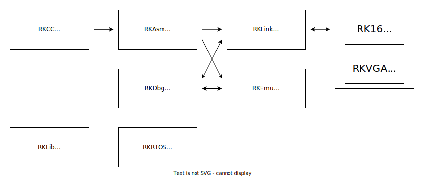

# RISC-K

💻 Home-made 16bit CPU & Toolchain

| Tools               |              |
| ------------------- | ------------ |
| [RKISA](./rkisa/)   | CPU ISA      |
| [RKAsm](./rkasm/)   | Assembler    |
| [RKEmu](./rkemu/)   | Emulator     |
| [RKCC](./rkcc/)     | Compiler     |
| [RKRTOS](./rkrtos/) | Real Time OS |
| [RK16](./rk16/)     | Hardware     |
| [RKLink](./rklink/) | Programmer   |
