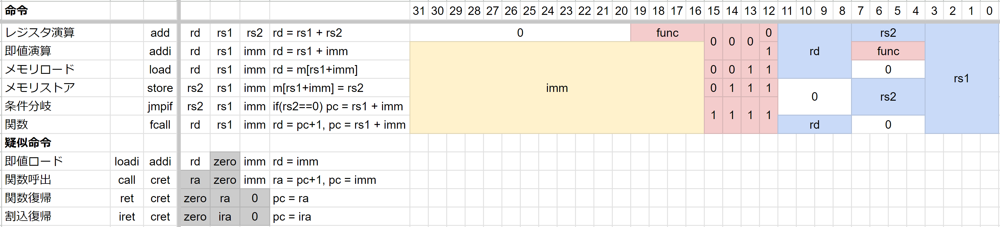

# RISC-K ISA

## 命令一覧

|           |     |
| --------- | --- | ------- | ------- |
| calc      | rd  | rs1     | rs2     |
| calci     | rd  | rs      | imm     |
| load      | rd  | rs      | imm     |
| loadi     | rd  | imm/lab |         |
| store     | rs  | rs      | imm     |
| jump      | ra  | rs      | imm/lab |
| breq/brlt | rs1 | rs2     | imm/lab |

- add / addi
- sub / subi
- and / andi
- or / ori
- not
